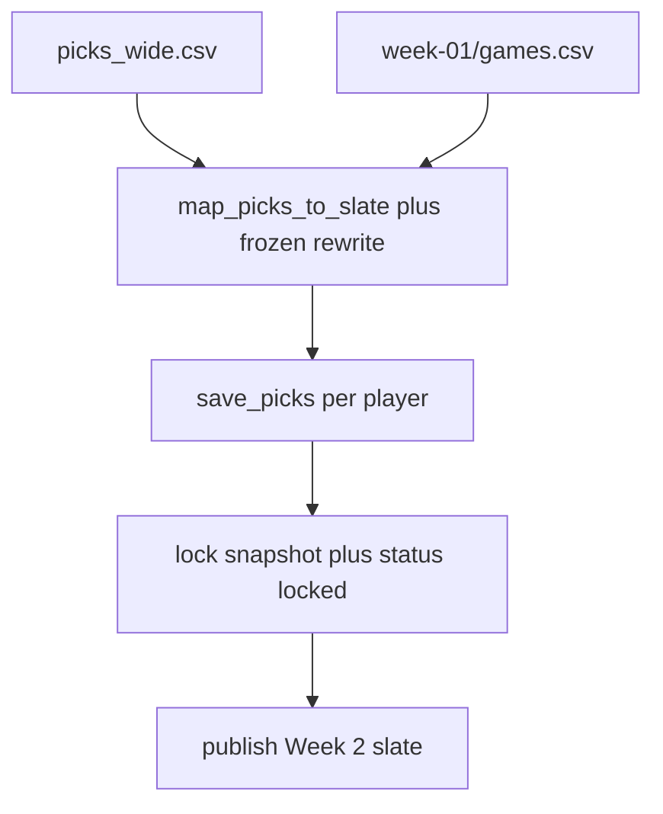

# Week 1 pick sim → local Week 2

**Canonical path:** [`.ai/plans/add-week1pick-sim-week2.md`](add-week1pick-sim-week2.md)

**Authority:** live code, tests, `AGENTS.md`, and `README.md` beat this file for current behavior. This file beats speculation about this launch rehearsal.

**Decided:** local `~/.cfbsicko/locks.db` only. Week 1 end state is **all twelve players have five picks and the week is locked** (board visible). No scores, no grade, no Fly `/data/locks.db`.

## Why this snapshot is enough (and what it is not)

[`data/assets/picks/picks_1.csv`](../../data/assets/picks/picks_1.csv) is a **wide sheet dump** (one column per player, five free-text rows). `data/` is gitignored, so the committed fixture is [`seeds/2026/week-01/picks_wide.csv`](../../seeds/2026/week-01/picks_wide.csv).

It can drive a faithful Week 1 rehearsal because [`map_picks_to_slate`](../../src/cfbsicko/parse.py) + [`save_picks`](../../src/cfbsicko/store.py) already turn that free text into `(game_id, market, side)` against frozen [`seeds/2026/week-01/games.csv`](../../seeds/2026/week-01/games.csv).

It is **not** a drop-in replacement for [`seeds/2026/week-01/picks.csv`](../../seeds/2026/week-01/picks.csv):

- Committed seed was missing **Mike** and **Rick**. The snapshot has five each.
- Scout’s `ILL/UAB Over 57.5` must keep rewriting to frozen **54.5** (`UAB/Illinois Over 54.5`). Do not reintroduce 57.5.
- Joe’s `Pitt-16.5` is Miami (OH) at Pittsburgh `-16.5`. Do not keep the old Cincinnati `-7.5` seed row.
- Trailing empty columns are ignored.
- Snapshot has no emails or scores.

Direct `INSERT` via [`seed_from_csv`](../../src/cfbsicko/seed_csv.py) is **not** “user actions.” Replay must call `save_picks` with `now` **before** `lock_at`, then lock.

## Locked (do not re-open)

- Local `~/.cfbsicko/locks.db` only. CLI refuses if the path looks like Fly (`/data/locks.db`) or the fantasy warehouse (`cfb.db` under `cfb_data`).
- Never `fly.seed-csv`, never `CONFIRM_PROD`, never `fly scale count 2`.
- Frozen Tuesday lines only.
- Exactly five structured picks.
- Board stays dark until lock; after this rehearsal Week 1 is locked so the board is visible.
- No `SCHEMA_SQL` edit. Money stays `buy_in_paid` flags.
- No Week 1 grade in this plan.

## Workstreams

### W0 — Promote the plan + commit the snapshot

Plan file, `.gitignore` exception, `picks_wide.csv`.

### W1 — Parse wide CSV against frozen Week 1 games

`extract_wide_picks` + rewrite Scout 54.5 + Joe Pitt. Write 60-row `picks.csv`.

### W2 — Replay as `save_picks` + lock (local only)

`cfbsicko replay-week1` / `make replay-week1`. Backup, refuse Fly, `--force` guard, lock snapshot.

### W3 — Local Week 2 open

Local rehearsal slate in `seeds/2026/week-02/`. Publish without touching Week 1 picks. Browser-verify pick sheet.

## Out of scope

Fly load, invite emails, Supabase OTP, Arrive/work league membership, CFBD grade, payout collection.
