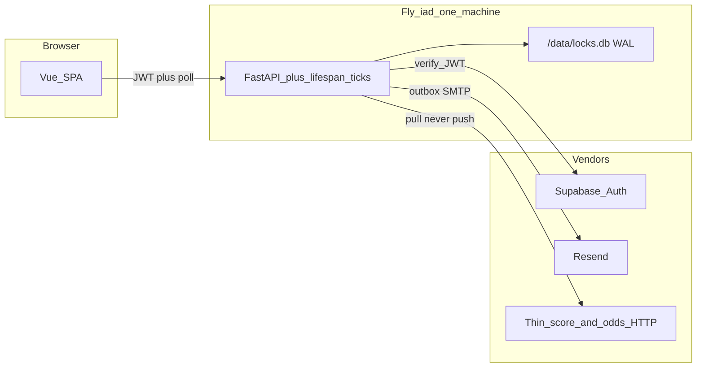
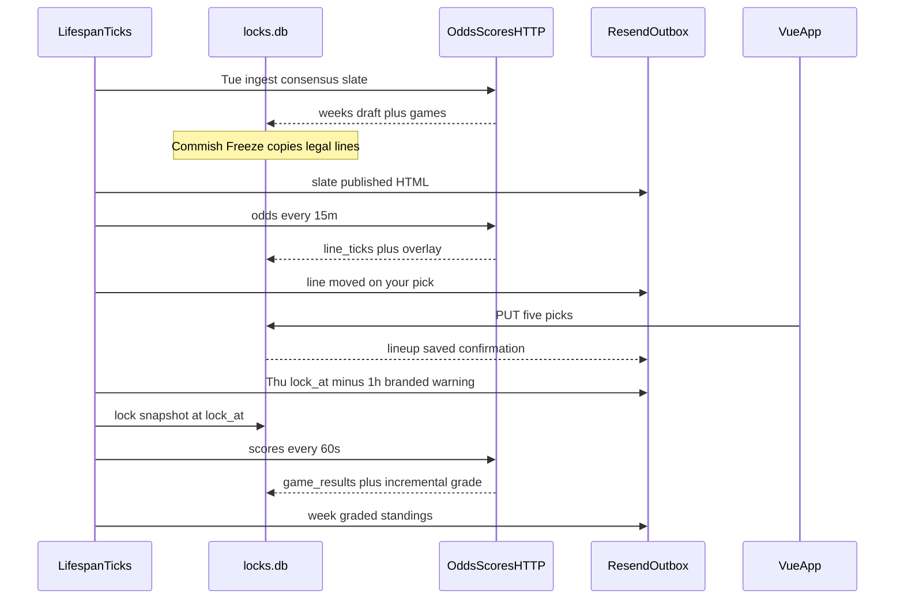

# Backend architecture — live locks UX

**Status:** planned 2026-09-04. Week 1 is already on frozen CSV lines. This file is the platform spec for auto-ingest, live scores, branded lock mail, and lineup notifications.

**Authority:** live code, tests, `AGENTS.md`, and `README.md` beat this file when they disagree about *current* behavior. This file beats [weekly-lines.md](weekly-lines.md) W7.5 and speculation about *next* platform work. Do not re-open [Locked](#locked).

**Do this after** [weekly-lines.md](weekly-lines.md) W7.1 (seed/publish refuse-by-default when picks exist). W8.1 may start in parallel with W7.2–W7.4. W8.5 must not run until W7.1 and W7.4 are green.

---

## Locked

- Standalone app. Not a cfbfPy feature. No `cfb-data` git pin.
- SQLite only: local `~/.cfbsicko/locks.db`, Fly `/data/locks.db`. Never `~/.cfb_data/cfb.db`.
- One Fly Machine, volume `cfbsicko_data`, region `iad`. Never `fly scale count 2`. `auto_stop_machines = off`.
- No Redis. No worker process. No SSE. No warehouse-push.
- Exactly five structured picks. **Frozen commissioner lines are the only legal number.** Thursday 18:00 America/New_York lock unless overridden.
- Board stays dark until lock. Lineup notifications never reveal another player’s picks before lock.
- Money is out of band (`buy_in_paid` flags only).
- Never edit `SCHEMA_SQL` in `src/cfbsicko/db.py` (checksum refuse-to-boot). Live objects are additive (`migrate_live`). `SCHEMA_VERSION` stays 1.
- Sync is pull: the one uvicorn process ticks, or `POST /api/internal/tick` with `CRON_TOKEN`. Never a second process.

---

## Goals vs non-goals

The game: weekly lineups, five locks by Thursday 6pm ET, results as live as a 12-person league needs, mail that actually fires.

| Goal | Meaning |
| --- | --- |
| Auto-updated odds | Tuesday slate can be drafted from a thin HTTP feed. After Freeze, a **market overlay** refreshes for display and “your lock moved” mail. |
| Legal line frozen | `games.spread_home` / `games.total` at Freeze. Grading and pick text always use this. |
| Live results | Scores pull into `game_results`; incremental ATS/OU as games go final. Commish override still wins. |
| 1-hour warning | Branded HTML + plaintext at `lock_at - 1 hour`, with a link to `/app`. Not a commish button hope. |
| Lineup-move notices | Player who saved gets email + in-app. Optional commish digest. Never leak the dark board. |

Non-goals: live line shopping, APNs/FCM push, chat, Stripe, public marketplace, iOS, Redis, a worker dyno, grading against the moving market.

“Odds automatically updated” does **not** mean the pickable number moves.

---

## What is broken today

- Slate is paste or CSV. No auto-ingest. `publish_slate` can wipe picks (W7.1 closes this).
- `lock_reminder_body` is plaintext and only sends when the commish clicks “Remind missing.”
- `game_results.source` allows `cfbd` but only `manual` is wired.
- No market ticks, no mail outbox, no in-app notifications, no incremental grade.
- Vue has no live score or overlay fields on `GET /api/weeks/current`.

---

## Topology



Update mechanism = the **existing** uvicorn process (`asyncio` lifespan loops) + durable SQLite tables. Twelve users, ~90 games/week. A second Machine or Redis would be theater.

`auto_stop_machines = off` is load-bearing: a cold start at Thursday 17:00 ET misses the warning.

---

## Product decision (do not reopen)

- **Legal line** = `games.spread_home` / `games.total` written at Freeze. `rules.grade_spread` / `grade_total` / `result_for_pick` never read the overlay.
- **Market overlay** = latest consensus on the same row (`market_spread_home`, `market_total`). Display + movement mail only.
- **Live scores** = `game_results` with `status` (`scheduled|in_progress|final`). Partial grade updates `picks.result` for games that have scores.
- **Lineup notifications** = that player changed their five. Email + `notifications` row to *that user*. Commish digest is counts only (“3 players changed locks”), never the games.

---

## Schema (additive)

Follow `migrate_leagues` in `src/cfbsicko/leagues.py`: `ALTER TABLE` + `CREATE TABLE IF NOT EXISTS` in `src/cfbsicko/live.py` → `migrate_live(conn)`, called from `db.migrate()` after `migrate_leagues`.

Keep: `weeks`, `games` (legal line), `picks`, `game_results`, `week_records`, `week_snapshots`, `audit_log`, `leagues`, `league_members`.

### `games` columns (ALTER)

```sql
-- kickoff already exists; populate it at Freeze
ALTER TABLE games ADD COLUMN provider_game_id TEXT;
ALTER TABLE games ADD COLUMN market_spread_home REAL;
ALTER TABLE games ADD COLUMN market_total REAL;
ALTER TABLE games ADD COLUMN market_updated_at TEXT;
ALTER TABLE games ADD COLUMN market_source TEXT;
```

Idempotent: `PRAGMA table_info(games)` before each ADD, same as invites `league_id`.

### `game_results` columns (ALTER)

```sql
ALTER TABLE game_results ADD COLUMN status TEXT NOT NULL DEFAULT 'final';
ALTER TABLE game_results ADD COLUMN period TEXT;
ALTER TABLE game_results ADD COLUMN clock TEXT;
ALTER TABLE game_results ADD COLUMN updated_at TEXT NOT NULL DEFAULT (datetime('now'));
```

Existing manual rows stay `final`. Live upserts set `scheduled|in_progress|final`.

### New tables

```sql
CREATE TABLE IF NOT EXISTS line_ticks (
    id INTEGER PRIMARY KEY,
    game_id INTEGER NOT NULL REFERENCES games(id) ON DELETE CASCADE,
    captured_at TEXT NOT NULL DEFAULT (datetime('now')),
    spread_home REAL NOT NULL,
    total REAL NOT NULL,
    source TEXT NOT NULL,
    UNIQUE (game_id, captured_at, source)
);

CREATE TABLE IF NOT EXISTS pick_revisions (
    id INTEGER PRIMARY KEY,
    user_id INTEGER NOT NULL REFERENCES users(id) ON DELETE CASCADE,
    week_id INTEGER NOT NULL REFERENCES weeks(id) ON DELETE CASCADE,
    saved_at TEXT NOT NULL DEFAULT (datetime('now')),
    payload_json TEXT NOT NULL
);

CREATE TABLE IF NOT EXISTS scheduled_jobs (
    id INTEGER PRIMARY KEY,
    week_id INTEGER NOT NULL REFERENCES weeks(id) ON DELETE CASCADE,
    kind TEXT NOT NULL,
    run_at TEXT NOT NULL,
    status TEXT NOT NULL DEFAULT 'pending',
    attempts INTEGER NOT NULL DEFAULT 0,
    locked_at TEXT,
    last_error TEXT,
    UNIQUE (week_id, kind)
);

CREATE TABLE IF NOT EXISTS mail_outbox (
    id INTEGER PRIMARY KEY,
    kind TEXT NOT NULL,
    week_id INTEGER REFERENCES weeks(id) ON DELETE CASCADE,
    league_id INTEGER,
    to_email TEXT NOT NULL,
    payload_json TEXT NOT NULL,
    dedupe_key TEXT NOT NULL,
    send_after TEXT NOT NULL DEFAULT (datetime('now')),
    sent_at TEXT,
    attempts INTEGER NOT NULL DEFAULT 0,
    last_error TEXT,
    UNIQUE (kind, week_id, to_email, dedupe_key)
);

CREATE TABLE IF NOT EXISTS notifications (
    id INTEGER PRIMARY KEY,
    user_id INTEGER NOT NULL REFERENCES users(id) ON DELETE CASCADE,
    kind TEXT NOT NULL,
    title TEXT NOT NULL,
    body TEXT NOT NULL,
    href TEXT,
    created_at TEXT NOT NULL DEFAULT (datetime('now')),
    read_at TEXT
);
```

`scheduled_jobs.kind`: `lock_warning_1h`, `lock_snapshot`, `standings_mail`, `slate_ingest_hint`.

`mail_outbox.kind`: `slate`, `lock_warning_1h`, `lock_warning_1h_complete`, `lineup_saved`, `line_moved`, `standings`, `commish_digest`.

Indexes (create if missing):

```sql
CREATE INDEX IF NOT EXISTS idx_line_ticks_game ON line_ticks (game_id, captured_at);
CREATE INDEX IF NOT EXISTS idx_outbox_due ON mail_outbox (sent_at, send_after);
CREATE INDEX IF NOT EXISTS idx_jobs_due ON scheduled_jobs (status, run_at);
CREATE INDEX IF NOT EXISTS idx_notifications_user ON notifications (user_id, read_at);
```

### Freeze writes

On commish Freeze (or first successful Tuesday publish that opens the week):

1. Write legal `spread_home` / `total`.
2. Copy those into `market_*` and set `market_source = 'freeze'`.
3. Resolve `provider_game_id` once (team names + kickoff date). Unmatched stay NULL; commish can paste the id in Admin.
4. `INSERT OR IGNORE` `scheduled_jobs` for `lock_warning_1h` at `lock_at - 1 hour` and `lock_snapshot` at `lock_at`.

If `lock_at` is later patched, UPDATE those two jobs when still `pending`.

---

## Weekly clock



**Tuesday ingest.** Thin HTTP client in this repo (CFBD or equivalent — consensus lines *and* scores). No `cfb-data` pin. Writes `weeks.status='draft'` + games. Commish owns Freeze ([weekly-lines.md](weekly-lines.md) W7.4 confirm modal). Auto-draft must not replace a frozen week that has picks (W7.1 guard).

**Thursday 1-hour warning.** Job `lock_warning_1h` enqueues HTML multipart (plain fallback) per league:

- `< 5` picks → `lock_warning_1h` (“You have N/5. Lock your five.” + `{PUBLIC_APP_URL}/app`)
- `5/5` → `lock_warning_1h_complete` (“Window closes in 1 hour — last chance to change.”)

Dedupe: `UNIQUE(kind, week_id, to_email, dedupe_key)` with `dedupe_key = lock_at`. Brand: landing dark card, “Lock your five”, lock time in America/New_York. Proton: plaintext part is the real body; do not rely on a magic link (OTP is typed).

**Lock.** `week_is_writable` already closes writes on the clock. Job `lock_snapshot` writes `week_snapshots` kind=`lock` if missing. No status cron required.

**Live scores.** Poll games with `kickoff` in a window or `status='in_progress'`. Upsert `game_results`. `grade_week(partial=True)` updates `picks.result` where a score exists; recomputes `week_records`. Week becomes `graded` only when every slate game is `final` **or** the commish hits Grade. Then enqueue `standings_mail`. Override path unchanged.

**Line-moved mail.** Overlay Δ ≥ 0.5 vs legal (or vs last notified tick for that user+game+market) **and** the user has that `(game_id, market)` picked **and** week still writable → that user only. Copy: “Houston is now −22 (your lock is still −20.5).”

**Lineup-move mail.** Inside `save_picks`, write `pick_revisions`. If a prior revision exists, enqueue `lineup_saved` with a 5-row before/after of **that player’s** slots. Optional daily `commish_digest`: “3 players changed locks” — no games, no sides.

---

## Tick loops

Same process. FastAPI lifespan starts four asyncio loops. Each loop is a `try/except` that logs and sleeps; a dead tick must not kill HTTP.

| Loop | Period | When it works | Work |
| --- | --- | --- | --- |
| `tick_jobs` | 15s | always | Claim due `scheduled_jobs` (`BEGIN IMMEDIATE`), run kind, mark `done`/`error` |
| `tick_outbox` | 15s | always | Send ≤ 20 due rows; backoff `send_after = now + 2^attempts minutes` (cap 60m); 8 attempts then leave `last_error` |
| `tick_odds` | 15m | Tue 10:00–Thu 18:00 ET while current week is `draft` or `open` | Pull consensus; write overlay; insert `line_ticks` only if Δ ≥ 0.5; enqueue `line_moved` |
| `tick_scores` | 60s | Fri 12:00–Mon 08:00 ET, **or** any game `in_progress` | Pull scores; skip `final` unless provider score changed; partial grade |

Claim pattern:

```sql
UPDATE scheduled_jobs
SET locked_at = datetime('now'), attempts = attempts + 1
WHERE id = (
    SELECT id FROM scheduled_jobs
    WHERE status = 'pending' AND run_at <= datetime('now') AND locked_at IS NULL
    ORDER BY run_at
    LIMIT 1
)
RETURNING *;
```

One Machine: `locked_at` is a crash lease. On boot, `UPDATE scheduled_jobs SET locked_at = NULL WHERE status = 'pending'`.

Optional poke: `POST /api/internal/tick` with header `X-Cron-Token: $CRON_TOKEN` runs one pass of all four ticks (same functions). GitHub Action or laptop cron may hit it. Empty `CRON_TOKEN` → route 404.

Tests mock the feed and the clock (`freezegun` or an injected `now`). No live HTTP in `make test`.

---

## Mail and notification matrix

Keep Resend SMTP. Add `EmailMessage` HTML alternative in `src/cfbsicko/mail.py`. Plaintext bodies stay for Proton. Commish Admin buttons insert outbox rows with `send_after=now` (same path as the scheduler).

| Kind | Trigger | Recipients | In-app | Reveals picks? |
| --- | --- | --- | --- | --- |
| `slate` | Freeze / Admin “Email slate” | League invited emails | “Week N lines are up” | No (slate only) |
| `lock_warning_1h` | Job at lock−1h | `< 5` picks | Yes | Own count only |
| `lock_warning_1h_complete` | Job at lock−1h | `5/5` | Yes | No |
| `lineup_saved` | `save_picks` after first revision | That player | Yes | Own five |
| `line_moved` | Odds tick, Δ ≥ 0.5 | Players who picked that game+market, pre-lock | Yes | Own lock + new market |
| `standings` | Week fully graded / Admin | League invited emails | Yes | Season table (already public post-lock) |
| `commish_digest` | Daily 10:00 ET pre-lock if any saves | League commish emails | Yes | Counts only |

HTML brand: landing header (CFB **Sicko**), dark card, primary “Lock your five” → `{PUBLIC_APP_URL}/app`. No tracking pixels. No other players’ names on pre-lock mail.

---

## API / UX deltas

Extend `GET /api/weeks/current` (and `GET /api/weeks/{n}`):

- `games[]`: existing legal `spread_home` / `total`; add `market_spread_home`, `market_total`, `market_updated_at`, `home_score`, `away_score`, `game_status`, `period`, `clock`
- `my_picks[]`: add live `result` when that game has a score
- `locked`, `lock_at` unchanged

New:

- `GET /api/me/notifications` → `{ items: [...], unread: N }`
- `POST /api/me/notifications/{id}/read`
- `POST /api/internal/tick` (cron token)
- Admin: Freeze badge, unmatched `provider_game_id` list, last tick timestamps, outbox failures (last 20)

Vue poll (no SSE): 30s on `/app` Friday–Monday and Thursday after 16:00 ET; 5 minutes otherwise. Standings page uses the same current-week payload once scores exist.

Paste + CSV upload stay ([weekly-lines.md](weekly-lines.md) W7.2–W7.4). Ingest is a third writer into the same `games` rows.

---

## Efficiency rules

- WAL + `busy_timeout=5000` + `synchronous=FULL` already on. Ticks use `BEGIN IMMEDIATE` for claims.
- Odds: skip games already `final`. Scores: skip `final` unless the provider score changed.
- Do not insert a `line_ticks` row when the number did not move ≥ 0.5.
- Delete `line_ticks` for a week after `lock_at` (legal line is what matters; overlay can remain on `games`).
- Outbox batch ≤ 20 sends per tick.
- No Parquet/Redis/queue product. Optional laptop Parquet archive stays W7.5.

---

## Workstreams

One PR each. Do not implement W8.n+1 in the same PR. W7.1 is a prerequisite for anything that writes games after picks exist.

### W8.1 — Outbox, jobs, branded 1-hour warning

- `migrate_live`, `scheduled_jobs`, `mail_outbox`
- HTML + plaintext `lock_warning_1h` / `lock_warning_1h_complete`
- Lifespan `tick_jobs` + `tick_outbox`
- Freeze/publish inserts the two lock jobs; `PATCH lock_at` moves pending jobs
- Admin “Remind missing” enqueues the same outbox kinds

Acceptance: freeze a week with `lock_at` in 61 minutes; advance clock; one warning per incomplete player, one “last chance” per complete player; second tick does not double-send. `make test` green.

### W8.2 — Pick revisions + lineup-saved + notifications

- `pick_revisions` written in `save_picks`
- `notifications` table + `/api/me/notifications`
- `lineup_saved` mail on 2nd+ save

Acceptance: first save is silent (or “locks in”); second save emails a 5-row diff to that user only. Another user’s `/api/me/notifications` is empty. Board still `null` pre-lock.

### W8.3 — Thin scores + incremental grade

- HTTP client in-repo, mocked in tests
- `game_results.status` / scores upsert; `grade_week(partial=True)`
- Current-week payload includes scores + `my_picks.result`

Acceptance: fixture scoreboard finals two of N games → those picks W/T/L, rest pending, week not `graded`. All finals → `graded` + `standings_mail` enqueued. Manual override still wins.

### W8.4 — Odds overlay + line ticks + line-moved

- Overlay columns + `line_ticks`
- `tick_odds` 15m in the Tue–Thu window
- `line_moved` only to holders of that pick, only while writable

Acceptance: overlay moves Houston −20.5 → −22; player with Houston spread is mailed once; player with only a total on another game is not; after lock, further moves do not mail.

### W8.5 — Tuesday draft ingest + Freeze confirm

- Requires W7.1 + W7.4 (no silent wipe, Admin confirm)
- Draft slate from the thin client; commish Freeze copies legal lines and resolves provider ids
- Unmatched games listed in Admin for a pasted `provider_game_id`

Acceptance: ingest Week N into `draft` without touching a frozen week that has picks. Freeze opens the week, copies overlay, schedules lock jobs, enqueues `slate` mail.

---

## How an agent should run W8.n

```text
Read .ai/plans/backend-arch.md and AGENTS.md.
Task: Implement workstream W8.n.
Deliverable: code + tests for that workstream’s acceptance line.
Do not implement W8.n+1 in the same PR.
Do not add Redis, SSE, a worker process, fly scale count 2, or live line shopping.
Do not edit SCHEMA_SQL.
```

---

## What not to build

- Live line shopping (grading or picking against the overlay)
- Push notifications (APNs / FCM / web push)
- Redis, SSE, a worker process, `fly scale count 2`
- `cfb-data` pin, warehouse-push, Google Sheets API on Fly
- Editing `SCHEMA_SQL`
- Revealing another player’s picks before lock
- Stripe, public multi-league marketplace, iOS, chat

---

## Done when

- [x] Additive `migrate_live` boots existing `/data/locks.db` without checksum change
- [x] Thursday `lock_at - 1h` mail sends without a commish click
- [x] Player save #2 emails that player a lineup diff; the board stays dark
- [x] Finals flow into `game_results` and the pick sheet shows live W/T/L
- [x] Overlay moves notify only holders, against the frozen legal number
- [x] Tuesday ingest cannot wipe a week that already has picks
- [x] `make test` green; one Machine; no Redis; no worker
