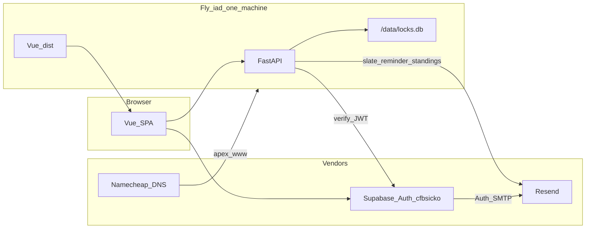

# CFB Sicko Locks League

**Canonical path:** `.ai/plans/build.md` (this file is the source of truth for later agents). Live code, tests, `AGENTS.md`, and `README.md` beat this plan when they disagree about *current* behavior; this plan beats speculation about *next* work.

**Status:** planned 2026-09-02. Week 1 lock is Thursday 6:00pm America/New_York. Sheet already has 12 players; Mike and Rick have no Week 1 picks.

**Do not copy** cfbfPy themes, Python package layout, Vue (they are vanilla JS), warehouse-push, Redis/SSE, Commish LLM, or the `cfb-data` git pin. **Do copy** the deploy harness: dedicated Supabase project, one Fly Machine + volume, Makefile fly.* targets, Resend domain verify + Auth SMTP, custom-domain certs, canonical-host 301, health curl, and a slim backup drill.

---

## How to run this plan

One workstream per PR unless noted. Do not re-open [Locked decisions](#locked-decisions-do-not-re-open).

```text
Read .ai/plans/build.md.
Task: Implement workstream W<n>.
Deliverable: Implement, verify with that workstream's acceptance criteria, report residual risk.
Do not start W<n+1> until W<n> acceptance is green, except W5 (deploy) may start once W1 has GET /api/health.
```

Order: **W0 → W1 → W2 → W3 → W4**. **W5** (cfbsicko.com) starts as soon as W1 health exists. **W6** last.

---

## Locked decisions (do not re-open)

1. **Standalone repo.** This is not a cfbfPy feature. Host `https://cfbsicko.com`. Fly app `cfbsicko`, region `iad`, volume `cfbsicko_data` → `/data`.
2. **Stack.** Python 3.13 + uv + FastAPI + Vue 3 (Vite) SPA. FastAPI serves the built `dist/` in prod. SQLite is the only app database.
3. **Own SQLite file.** Local `~/.cfbsicko/locks.db`. Fly `/data/locks.db`. Never use `~/.cfb_data/cfb.db` (that is the fantasy warehouse). The current `.env` `DATABASE_PATH` is wrong and must be replaced.
4. **No `cfb-data` dependency.** No private git pin, no `GITHUB_TOKEN` build secret, no warehouse-push. Scores are pasted (or later a thin CFBD client) into *this* DB.
5. **Auth = dedicated Supabase project `cfbsicko`** (not the cfbfantasy project). Email provider on. App verifies Supabase JWTs (JWKS / `authenticated` audience). League membership is an **invite allowlist** in SQLite — signup without an invite cannot see or submit picks.
6. **Resend is required for launch.** Product mail (`locks@cfbsicko.com`) *and* Supabase Auth SMTP must use the same verified `cfbsicko.com` domain. Built-in Supabase mail is 2/hour and will 429 on invite week.
7. **One Machine, never `fly scale count 2`.** `auto_stop_machines = "off"`. shared-cpu-1x / 512MB is enough. No Redis, no worker process.
8. **Structured picks.** Each pick is `(game_id, market=spread|total, side)`. Exactly 5. Spread + total on the same game is allowed (two picks). Duplicate `(game, market)` is not. Free-text is import-only (Week 1 sheet).
9. **Frozen commissioner lines.** Tuesday publish is the only legal number. No live line shopping.
10. **Lock = Thursday 18:00 America/New_York** unless the commissioner sets a different `lock_at` for that week. After lock: no create/update/delete. Other players' picks stay hidden until lock.
11. **Auto-grade + override.** ATS / total vs frozen line from final scores. Push → T. Commissioner can override a pick result. Standings = season W-T-L, then weekly record as tie-break display.
12. **Money is out of band.** Track `buy_in_paid` / `settled` flags only. No Stripe. Payout math is display: pot = N_paid × $75; 60/30/10; bottom 3 each owe $75 to one of top 3.
13. **Season scope.** 2026 regular season only. No CCG, no Army-Navy. FBS vs FCS is in (Week 1 already is).
14. **Commissioner** is the first `COMMISH_ALLOWED_EMAILS` entry (Rick). Never `*`.
15. **Scratch plans stay gitignored** except this file once promoted. Do not commit `.env` or `*.xlsx` if they contain emails; the master sheet is display-names only and may be committed under `data/assets/`.

---

## Outcome and primary risk

**Outcome:** twelve humans replace the Google Sheet + backup email. Tuesday the commissioner pastes the slate; by Thursday 6pm ET each player has exactly five structured picks; Sunday (or Tuesday if Monday night) standings update without a spreadsheet.

**Primary risk:** a late pick that the lock clock does not enforce, or a silent JWT/redirect misconfig so invite mail opens `127.0.0.1` on production. Second risk: Auth SMTP left on Supabase's 2/hour mailer.

---

## Current facts (sheet)

Source: `data/assets/CFB Locks MASTER SHEET 2026.xlsx`

- Tabs: `Week 1` (picks grid), `WEEK 1 LINES` (email-format slate), `Season Standings` (empty ranks).
- Players (row 4): Stu, Jack, Billy, Mike, Rick, Wil, Scout, Kenny, Owen, Luke, Joe, Rob.
- Empty Week 1 columns: **Mike**, **Rick**. Everyone else has 5 free-text picks (`Houston -20.5`, `Purdue/ISU Under 57.5`, `Washington State +23.5`).
- Sheet already has WINS / TIES / LOSSES / Weekly Record rows — encode that exact record shape.

---

## Architecture



Copy from cfbfPy (harness only): dedicated Supabase project, `make supabase.check`, one Fly process + volume, `PUBLIC_APP_URL` forced on secrets, Dockerfile migrate-on-boot, canonical-host 301 for document URLs, Resend on `send.` subdomain.

Do not copy: `cfb-data` pin, `GITHUB_TOKEN` deploy, warehouse-push, Redis, SSE, 2GB RAM, landing-funnel UTMs, iOS app.

---

## Data model (SQLite)

- `users` — `supabase_user_id`, email, display_name, `is_commish`, `buy_in_paid`, created_at
- `invites` — email, token hash, invited_by, accepted_at, expires_at
- `weeks` — season, week_no, title, `publish_at`, `lock_at`, `standings_at`, status (`draft|open|locked|graded`)
- `games` — week_id, kickoff, away, home, `spread_home` (home perspective, frozen), `total`, day_label
- `picks` — user_id, week_id, slot 1–5, game_id, market, side (`home|away|over|under`), result (`pending|W|T|L`), override_result
- `game_results` — game_id, home_score, away_score, source (`manual|cfbd`), entered_by
- `week_records` — user_id, week_id, wins, ties, losses
- `audit_log` — actor, action, entity, before/after JSON
- `week_snapshots` — serialized JSON copy after each lock and each grade

---

## Product rules (must be unit-tested)

- Exactly 5 picks; any mix of spread/total.
- Same game may appear twice only if markets differ.
- Submit/edit only while `now < lock_at` and week status is `open`.
- Other users' picks: hidden until lock.
- Grade: home covers if `home_score + spread_home > away_score`; equal is push. Total: over if sum > total; equal is push.
- Season standings sort: wins desc, losses asc; show `W-T-L`.
- Payout preview uses **paid** headcount, not roster size.
- Import maps Week 1 free-text onto structured picks; unmapped strings fail the import with a row report (do not silently drop).

---

## Workstreams

- **W0** — Skeleton, rules engine, sheet import
- **W1** — Supabase Auth + player pick API/UI
- **W2** — Commissioner slate + lock
- **W3** — Scores, grade, standings, payouts
- **W4** — Resend product mail
- **W5** — Deploy harness to cfbsicko.com
- **W6** — Hardening (snapshots, restore CONFIRM gates, pre-commit, browser verify)

---

## What not to build

Public multi-league, Stripe, live odds, chat, push notifications, cfbfPy theme, iOS, Redis, conference championships, Army-Navy, line-movement tracker (nice-to-have later).
